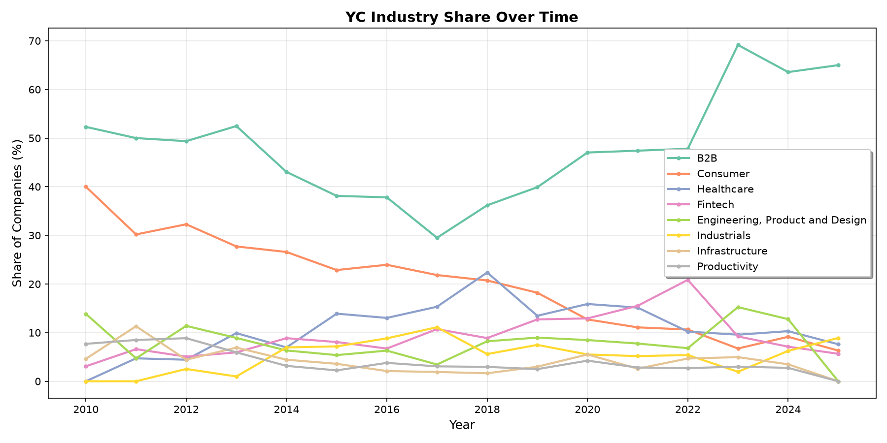
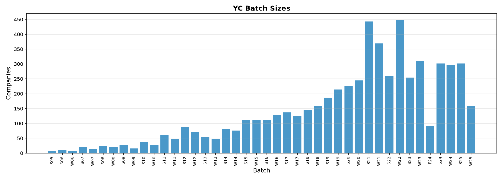
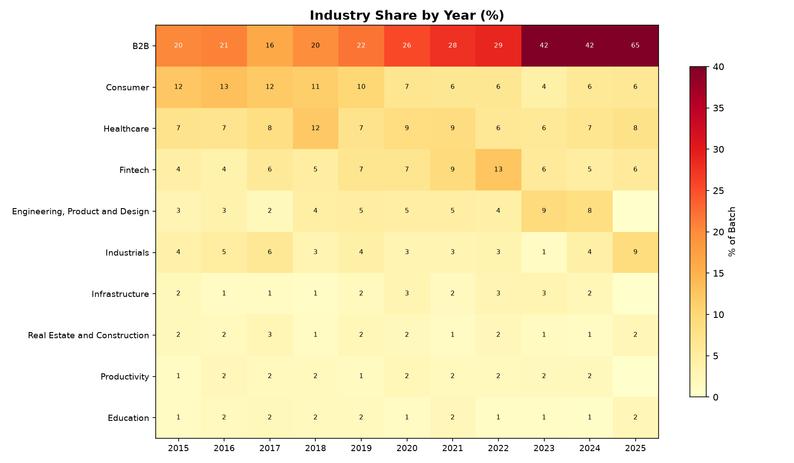
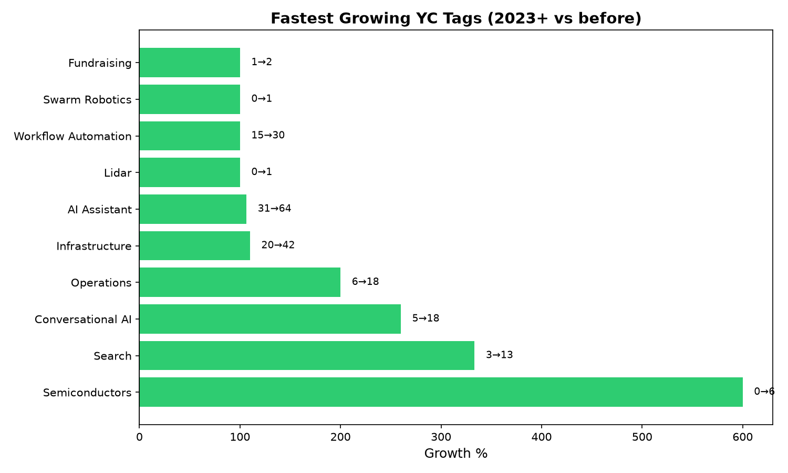
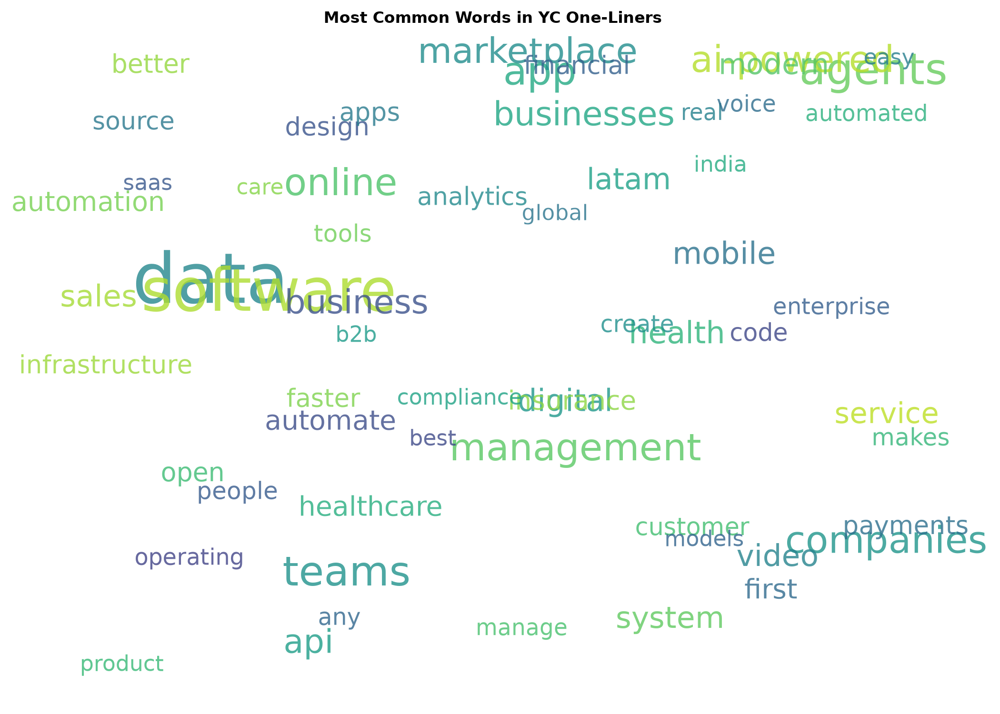
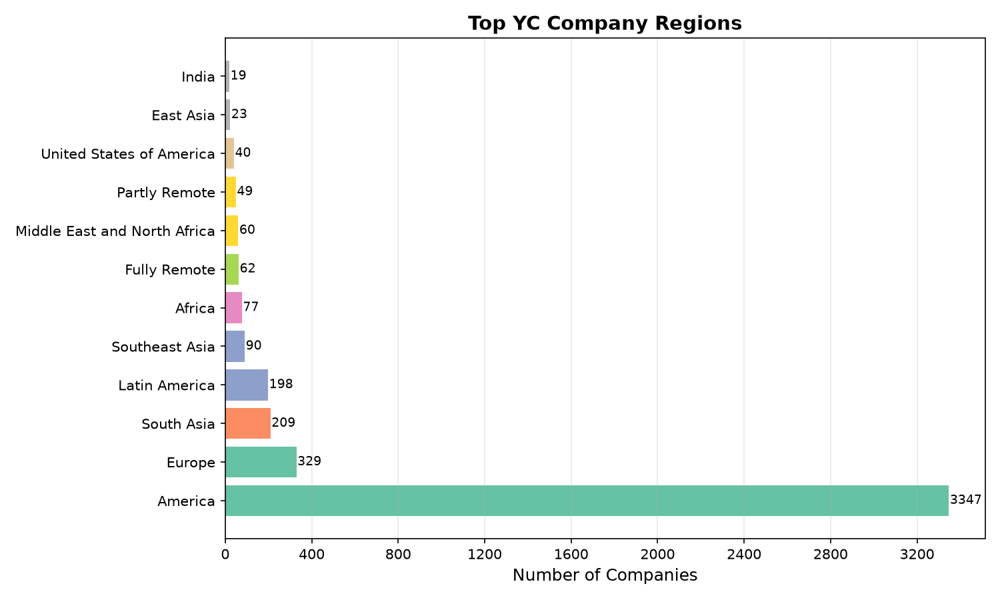
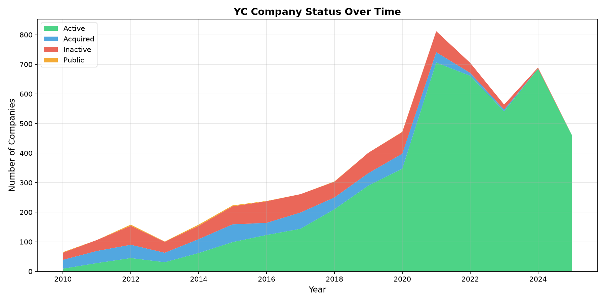
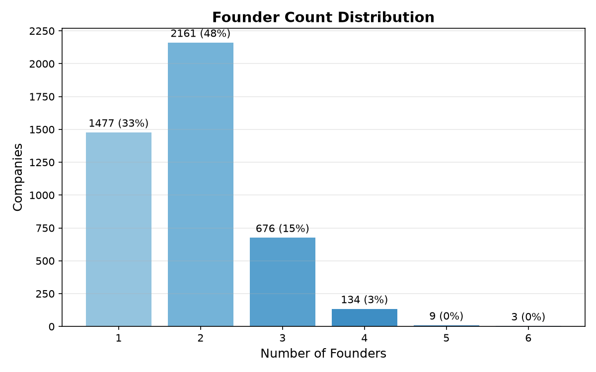
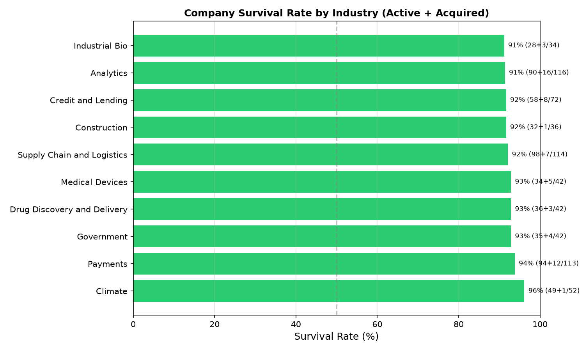

# ycombigenerator

A Y Combinator company analyzer and hypothetical startup generator. Analyzes 5,864 YC companies (2005–Summer 2025) across 42 batches to uncover industry trends, predict emerging topics, and generate realistic startup ideas.

## Visualizations

All plots are generated with `yc plot` and saved to `figures/`.

### Industry Share Over Time
YC has shifted from consumer-heavy to B2B-dominated over the last decade.


### Batch Sizes
YC has grown from ~8 companies per batch in 2005 to hundreds per batch today.


### Industry Heatmap
B2B dominance across years, with Healthcare and Fintech emerging strongly.


### Growing Topics
Semiconductors, Conversational AI, and Search are the fastest-growing tags.


### Word Cloud
The most common words in YC company one-liners.


### Geographic Distribution
Most YC companies are in North America, with significant clusters in Asia and Europe.


### Company Status Over Time
The growing share of companies that remain active over recent years.


### Founder Distribution
Most YC companies have 2–3 founders.


### Survival Rate by Industry
Industries ranked by percentage of companies still active or acquired.


## Commands

| Command | Description |
|---|---|
| `yc stats` | Dataset statistics and distributions |
| `yc analyze` | Industry trends and growing tags |
| `yc trends` | Predicted next YC trends |
| `yc generate --template` | Generate startup idea (local, no server needed) |
| `yc generate` | Generate with opencode SDK (requires `opencode serve`) |
| `yc generate --count 5` | Generate multiple ideas |
| `yc generate --prompt "climate tech"` | Generate with a custom direction |
| `yc plot` | Generate all 9 visualizations in `figures/` |
| `yc refresh` | Download latest dataset |
| `yc info` | Show configuration |

## Setup

```bash
uv sync
yc stats           # verify the dataset loaded
yc plot            # generate visualizations
yc generate -t     # try the template generator
```

## Data

- **Primary:** [24msingh24/2024-YCombinator-All-Companies-Datasets](https://github.com/24msingh24/2024-YCombinator-All-Companies-Datasets) (~4,800 companies, 2005–2024, rich relational data)
- **Supplement:** [nikshepg/YC-Startup-Directory](https://github.com/nikshepg/YC-Startup-Directory) (~1,000, up to Summer 2025)
- **Total:** 5,864 companies across 42 batches, stored in `data/` (versioned in repo)

## Generation

Without a running opencode server, use `--template` for local generation:

```bash
yc generate -t
# → #1: DataDemocratizes
#   AI-powered compliance tracking for data scientists.
#   Industry: B2B
```

With the opencode SDK (start `opencode serve` first and set `OPENCODE_API_KEY`):

```bash
export OPENCODE_API_KEY=sk-...
opencode serve &
yc generate
```
